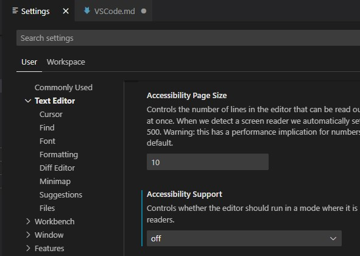

# Preparing your VSCode environment for use with the robot-template

## Install extensions

### How to install extensions in VSCode

To install extensions in VSCode, you first click on the extensions side bar (or type <Ctrl+Shift+X>).  It will show you a list of your installed extensions. Use this list to verify that you have the extensions in the following section installed. To search of an extension, simply type its name in the search field at the top of the extensions panel and it will display all the extensions in the extension marketplace that have those words. When you find the one you want, click on it to bring up an editor window with its description page. To install it, click on the "Install" button, either on the description page, or the one next to its name in the extensions list. After the extension is install, the install button on the list will change to settings gear icon, and the button on description will change to "Uninstall". You can use this "Uninstall" button to uninstall the extension if you no longer want it.

### Pre-Installed extensions

The following extensions come preinstalled in the WPILIB VSCode environment. If they are not installed, then you are not using the correct version of VSCode.

- C/C++
- Debugger for Java
- Language Support for Java
- Project Manager for Java
- WPILIB

### Install these extensions

These extensions need to be installed in you WPILIB VSCode. Some of are extension packs, which means that installing them actually causes a set of extensions to be installed. Extension packs here will have an indented list of extensions that the pack will install. You will not need to install these individually. In a later section in this document we will deal with how to set these extensions up, but for now, just install them.

- Checkstyle for Java
- Git Extension Pack (be sure to pick the one from Don Jayamanne, with over a million downloads.)
  - Git History
  - gitignore
  - GitLens
  - Open in Github, Bitbucket, Gitlab, Visualstudio.com
  - Project Manager
- Git Graph
- Github Pull Requests and Issues
- Intellicode
- Sonarlint
- Code Spell Checker
- Gradle Extension Pack
  - Gradle for Java
  - Gradle Language Support

## Configure settings for VSCode with extensions

### How to set VSCode preferences

VSCode stores its settings in files called settings.json. There are two ways to change the settings.json file and the file itself can be in two locations. There is one file that sets the preferences for the user, no matter what project the user is working on and another file for setting the preferences for the current workspace only.

The easiest way to change the preferences is using the settings editor. You can bring up the settings editor either by using the "File" menu, selecting the "Preferences" side menu and choosing "Settings", or by typing <Ctrl+,> 

There are two tabs in the editor, one called "User" and one called "Workspace", corresponding to the two settings.json files. The settings editor is a user friendly GUI for setting the most common preferences. The change the settings for extensions, scroll down the list to where it says "Extensions" and click on it to expand the list. You can also use the search bar at the top to search for specific settings.

Sometimes you need to edit the settings.json files directly. The easiest way to open the files in a VSCode editor window is to open the settings editor, then click the tab that corresponds to the file you want, either the user or workspace file, and then scroll down until you see a line that says "Edit in settings.json file".   Just click that line an an editor will appear with the correct file. The setting that was associated with the line will be inserted in the file, but you can just use the "Undo" command under the "Edit" menu (or <Ctrl+z>) to remove it again.

The syntax of JSON files is beyond the scope of this document, but if you are aksed to directly modify one you will be shown exactly what to enter.

Once the file is is changed how you want, remember to save it.

### Specific Preference Settings

#### Recommended preferences

The following preferences are not required to use the robot template, but are just some changes that we recommend to make VSCode easier to work with.

- Bracket Pairs. By default VSCode colors matching bracket pairs with the same color. Further, if you click on one bracket in a pair, the other will also get a hollow cursor on it. However, it is easy to not notice a missing bracket or parenthesis if you are not looking for it. We therefore recommend changing the user setting "Bracket Pairs" tp "active". With both bracket pairs settings set to active VSCode will draw a colored line between the innermost enclosing brackets, based on where the cursor is. 

### Construction ahead

Spotbugs places report in the project directory under
build/reports/spotbugs in file main.html

Spotbugs exclusions are placed in config/spotbugs/excludeFilter.xml
Syntax is at https://spotbugs.readthedocs.io/en/stable/filter.html
Open preferences page, search for "bracketpair". Look for the line that says:

Editor › Guides: Bracket Pairs
Controls whether bracket pair guides are enabled or not.

And set it to active.

- Checkstyle for Java.
Once installed bring up the command palette and filter on "checkstyle". Select "Set the Checkstyle Configuration File". Select "/google_check.xml".
